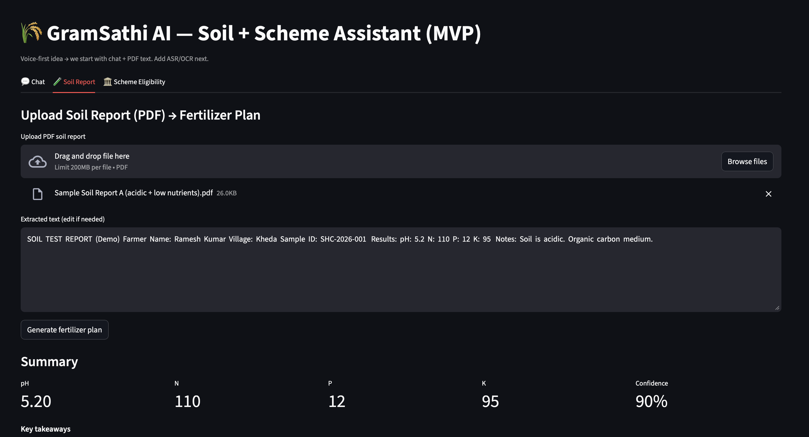
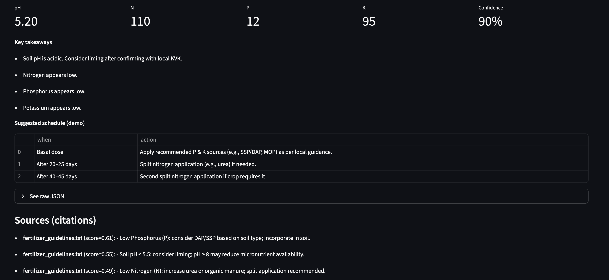
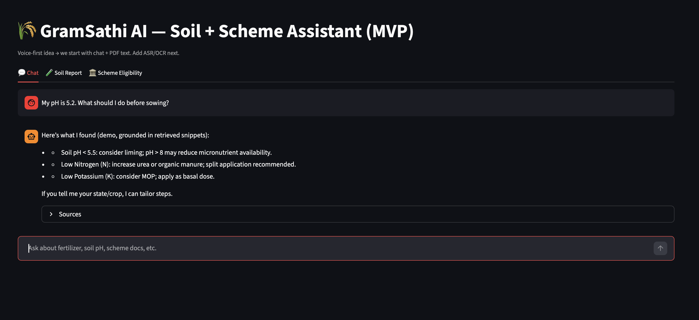
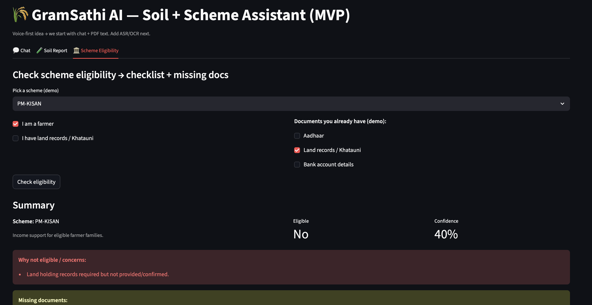
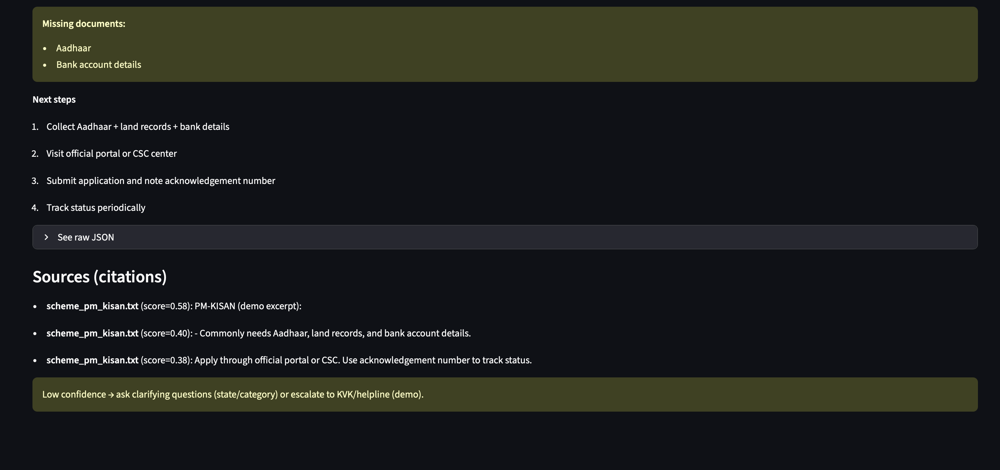

# 🌾 GramSathi AI — Soil + Scheme Assistant (MVP)

A **Streamlit** prototype for a *voice-first* rural assistant (starting with chat + PDFs).  
This MVP helps users:

1) **Interpret a Soil Health Card / Soil Test PDF** → extract key values (pH, N, P, K) → generate a **readable fertilizer plan**  
2) **Check Government Scheme eligibility** (demo rules) → show **missing documents + next-step checklist**  
3) Ask questions via **RAG-based chat** grounded in a small local knowledge base (**KB docs**) with citations.

> ⚠️ Demo-grade logic. Always validate with local KVK / agri experts before taking action.

Tryout the Demo at  :)

---

## ✨ Features

### 💬 Chat (RAG Q&A)
- Retrieval-augmented answers from `data/kb_docs/*.txt`
- Shows **sources** (doc name + snippet + score)
- “Grounded answers only” behavior:
  - If retrieval confidence is low, asks clarifying questions

### 🧪 Soil Report → Fertilizer Plan
- Upload a soil report **PDF**
- Extract text using `pypdf`
- Parse soil values (`pH`, `N`, `P`, `K`) from text (regex)
- Generate:
  - **Metric summary**
  - **Key takeaways**
  - **Suggested schedule** (demo)
  - **Raw JSON** (expandable)
  - **KB citations** from fertilizer guidance docs

### 🏛️ Scheme Eligibility (Demo)
- Pick a scheme (e.g., **PM-KISAN**) from `data/schemes.json`
- Simple checkbox-based user profile + documents
- Outputs:
  - Eligible / Not eligible
  - Reasons / concerns
  - Missing documents
  - Next-step checklist
  - KB citations grounded in scheme notes

---

## 🖼️ Screenshotspip freeze > requirements.txt


- Soil report upload + extraction  
  

- Soil summary + fertilizer plan  
  

- Chat with grounded snippets + sources  
  

- Scheme eligibility inputs  
  

- Scheme result: missing docs + checklist + citations  
  

---

## 🧱 Tech Stack

- **Streamlit** UI
- **pypdf** for PDF text extraction
- **SentenceTransformers** (`all-MiniLM-L6-v2`) for embeddings
- **FAISS** for vector search (cosine via normalized embeddings)

---

## 📁 Project Structure

```
GramSathiAI/
  app.py                 # Streamlit app (tabs: Chat / Soil / Schemes)
  rag.py                 # SimpleRAG: load KB text chunks, embed, FAISS search
  soil.py                # soil parsing + fertilizer_plan (demo logic)
  schemes.py             # load schemes + simple eligibility logic
  data/
    kb_docs/
      fertilizer_guidelines.txt
      scheme_pm_kisan.txt
      ...
    schemes.json         # list of schemes, rules, required docs, steps
  screenshots/
    soilreport1.png
    soilreport2.png
    chat.png
    scheme1.png
    scheme2.png
```

---

## ✅ Quickstart

### 1) Create environment (recommended)

```bash
python -m venv .venv
source .venv/bin/activate   # macOS/Linux
# .venv\Scripts\activate  # Windows (PowerShell)
pip install -U pip
```

### 2) Install dependencies

```bash
pip install streamlit pypdf sentence-transformers faiss-cpu numpy
```

> Notes:
> - On Apple Silicon, `faiss-cpu` should generally work, but if you hit install issues,
>   consider using conda or platform-specific FAISS wheels.

### 3) Add KB docs + schemes

Create these folders/files:

- `data/kb_docs/` → add `.txt` files (one paragraph/line = one chunk)
- `data/schemes.json` → example structure below

Example `data/schemes.json`:

```json
[
  {
    "name": "PM-KISAN",
    "description": "Income support for eligible farmer families.",
    "rules": { "must_be_farmer": true, "land_holding_required": true },
    "required_documents": ["Aadhaar", "Land records / Khatauni", "Bank account details"],
    "steps": [
      "Collect Aadhaar + land records + bank details",
      "Visit official portal or CSC center",
      "Submit application and note acknowledgement number",
      "Track status periodically"
    ]
  }
]
```

### 4) Run the app

```bash
streamlit run app.py
```

---

## 🧪 Demo Inputs

### Soil report sample text (works with current regex)
The parser can detect patterns like:

- `pH: 5.2`
- `N: 110`
- `P: 12`
- `K: 95`

Example extracted text:

```
SOIL TEST REPORT (Demo)
Results: pH: 5.2  N: 110  P: 12  K: 95
Notes: Soil is acidic. Organic carbon medium.
```

---

## 🔍 How RAG Works (in this MVP)

- KB = text files in `data/kb_docs/`
- Each non-empty line becomes a chunk
- We embed chunks and queries with SentenceTransformers
- FAISS retrieves top-k chunks using cosine similarity
- App displays citations with `(doc, score, snippet)`

---

## 🚧 Limitations (MVP)

- Soil parsing is **regex-based** and fragile across report formats
- Fertilizer plan is **generic** (no crop/state-specific dose calculations yet)
- Scheme rules are **simplified** and do not cover state/category exceptions
- KB citations are only as good as the curated text docs you add

---

## 🛣️ Roadmap (Next)

- ✅ Add OCR (for scanned PDFs / photos)
- ✅ Add voice: ASR + TTS (Hindi/regional languages)
- Crop + soil-type specific recommendations (region-aware)
- Stronger eligibility engine (rule graph + state variations)
- Better confidence scoring + fallback to helpline/KVK routing
- Multilingual UI + transliteration support

---

## 🤝 Contributing

PRs welcome. If you add:
- more scheme templates in `data/schemes.json`
- more KB docs (official/verified sources)
- better soil parsers for common Indian report layouts

…this gets much more useful fast.

---

## 📜 Disclaimer

This project provides **informational assistance only**. It does **not** replace advice from
qualified agricultural experts, KVK, or official scheme portals. Always verify before acting.
